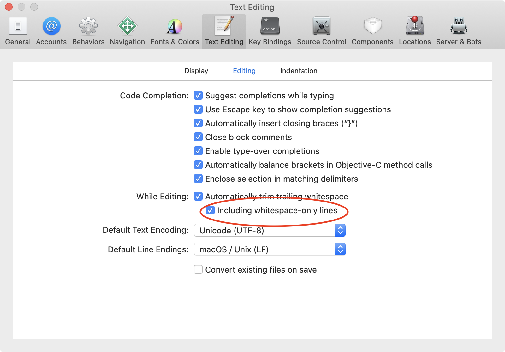
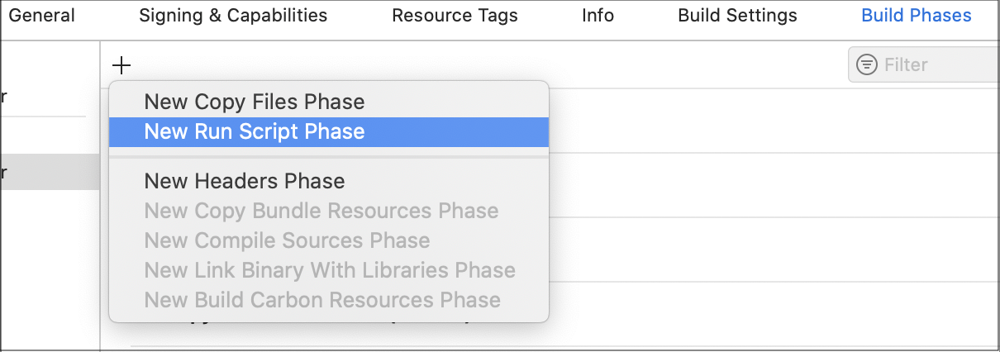
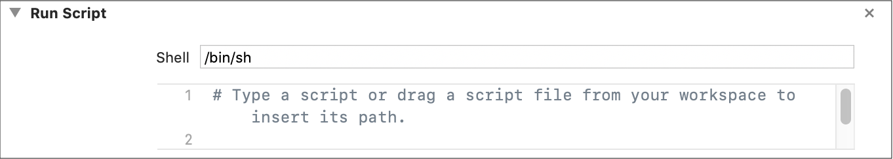

# Swift Style Guide.

## Table of Contents

- [Table of Contents](#table-of-contents)
- [Correctness](#correctness)
- [Using SwiftLint](#using-swiftlint)
- [Naming](#naming)
  - [Class Prefixes](#class-prefixes)
  - [Delegates](#delegates)
  - [Use Type Inferred Context](#use-type-inferred-context)
  - [Generics](#generics)
  - [Language](#language)
- [Code Organization](#code-organization)
  - [Protocol Conformance](#protocol-conformance)
  - [Minimal Imports](#minimal-imports)
- [Spacing](#spacing)
- [Comments](#comments)
- [Documentation Comments](#documentation-comments)
  - [Single-Sentence Summary](#single-sentence-summary)
  - [Parameter, Returns, and Throws Tags](#parameter-returns-and-throws-tags)
  - [Apple’s Markup Format](#apples-markup-format)
  - [Where to Document](#where-to-document)
- [Classes and Structures](#classes-and-structures)
  - [Use of Self](#use-of-self)
  - [Computed Properties](#computed-properties)
- [Function Declarations](#function-declarations)
- [Function Calls](#function-calls)
- [Closure Expressions](#closure-expressions)
- [Types](#types)
  - [Constants](#constants)
  - [Static Methods and Variable Type Properties](#static-methods-and-variable-type-properties)
  - [Optionals](#optionals)
  - [Lazy Initialization](#lazy-initialization)
  - [Type Inference](#type-inference)
  - [Type Annotation for Empty Arrays and Dictionaries](#type-annotation-for-empty-arrays-and-dictionaries)
  - [Syntactic Sugar](#syntactic-sugar)
- [Functions vs Methods](#functions-vs-methods)
- [Memory Management](#memory-management)
  - [Extending object lifetime](#extending-object-lifetime)
- [Access Control](#access-control)
- [Control Flow](#control-flow)
  - [Ternary Operator](#ternary-operator)
- [Golden Path](#golden-path)
  - [Failing Guards](#failing-guards)
- [Semicolons](#semicolons)
- [Parentheses](#parentheses)
- [Multi-line String Literals](#multi-line-string-literals)
- [Copyright Statement](#copyright-statement)
- [Other considerations:](#other-considerations)
- [Formatting/Linting tools](#formattinglinting-tools)
- [SwiftLint Policy](#swiftlint-policy)
  - [Installing SwiftLint](#installing-swiftlint)
  - [Using the Configuration File](#using-the-configuration-file)
  - [Xcode Settings](#xcode-settings)
  - [Running SwiftLint](#running-swiftlint)
  - [Handling Rule Exceptions](#handling-rule-exceptions)
  - [Other Notes](#other-notes)
- [References](#references)


## Correctness

Strive to make your code compile without warnings. This rule informs many style decisions such as using `#selector` types instead of string literals.

## Using SwiftLint

To enforce most of the guidelines in this document, we suggest to use our SwiftLint configuration. See the [SwiftLint Policy](#swiftlint-policy) section for more information.

## Naming

Descriptive and consistent naming makes software easier to read and understand. Use the Swift naming conventions described in the [API Design Guidelines](https://swift.org/documentation/api-design-guidelines/). Some key takeaways include:

- striving for clarity at the call site
- prioritizing clarity over brevity
- using `camelCase` (not `snake_case`)
- using `UpperCamelCase` for types and protocols, `lowerCamelCase` for everything else
- including all needed words while omitting needless words
- using names based on roles, not types
- sometimes compensating for weak type information
- striving for fluent usage
- beginning factory methods with `make`
- naming methods for their side effects
  - verb methods follow the -ed, -ing rule for the non-mutating version
  - noun methods follow the formX rule for the mutating version
  - boolean types should read like assertions
  - protocols that describe _what something is_ should read as nouns
  - protocols that describe _a capability_ should end in _-able_ or _-ible_
- using terms that don't surprise experts or confuse beginners
- generally avoiding abbreviations
- using precedent for names
- preferring methods and properties to free functions
- casing acronyms and initialisms uniformly up or down
- giving the same base name to methods that share the same meaning
- avoiding overloads on return type
- choosing good parameter names that serve as documentation
- preferring to name the first parameter instead of including its name in the method name, except as mentioned under Delegates
- labeling closure and tuple parameters
- taking advantage of default parameters

### Class Prefixes

Swift types are automatically namespaced by the module that contains them and you should not add a class prefix such as PI. If two names from different modules collide you can disambiguate by prefixing the type name with the module name. However, only specify the module name when there is possibility for confusion, which should be rare.

```swift
import SomeModule

let myClass = MyModule.UsefulClass()
```

### Delegates

When creating custom delegate methods, an unnamed first parameter should be the delegate source. (UIKit contains numerous examples of this.)

**Preferred**:
```swift
func namePickerView(_ namePickerView: NamePickerView, didSelectName name: String)
func namePickerViewShouldReload(_ namePickerView: NamePickerView) -> Bool
```

**Not Preferred**:
```swift
func didSelectName(namePicker: NamePickerViewController, name: String)
func namePickerShouldReload() -> Bool
```

### Use Type Inferred Context

Use compiler inferred context to write shorter, clear code.  (Also see [Type Inference](#type-inference).)

**Preferred**:
```swift
let selector = #selector(viewDidLoad)
view.backgroundColor = .red
let toView = context.view(forKey: .to)
let view = UIView(frame: .zero)
```

**Not Preferred**:
```swift
let selector = #selector(ViewController.viewDidLoad)
view.backgroundColor = UIColor.red
let toView = context.view(forKey: UITransitionContextViewKey.to)
let view = UIView(frame: CGRect.zero)
```

### Generics

Generic type parameters should be descriptive, upper camel case names. When a type name doesn't have a meaningful relationship or role, use a traditional single uppercase letter such as `T`, `U`, or `V`.

**Preferred**:
```swift
struct Stack<Element> { ... }
func write<Target: OutputStream>(to target: inout Target)
func swap<T>(_ a: inout T, _ b: inout T)
```

**Not Preferred**:
```swift
struct Stack<T> { ... }
func write<target: OutputStream>(to target: inout target)
func swap<Thing>(_ a: inout Thing, _ b: inout Thing)
```

### Language

Use US English spelling to match Apple's API.

**Preferred**:
```swift
let color = "red"
```

**Not Preferred**:
```swift
let colour = "red"
```

## Code Organization

Use extensions to organize your code into logical blocks of functionality. Each extension should be set off with a `// MARK: -` comment to keep things well-organized.

### Protocol Conformance

In particular, when adding protocol conformance to a model, prefer adding a separate extension for the protocol methods. This keeps the related methods grouped together with the protocol and can simplify instructions to add a protocol to a class with its associated methods.

**Preferred**:
```swift
class MyViewController: UIViewController {
  // class stuff here
}

// MARK: - UITableViewDataSource
extension MyViewController: UITableViewDataSource {
  // table view data source methods
}

// MARK: - UIScrollViewDelegate
extension MyViewController: UIScrollViewDelegate {
  // scroll view delegate methods
}
```

**Not Preferred**:
```swift
class MyViewController: UIViewController, UITableViewDataSource, UIScrollViewDelegate {
  // all methods
}
```
### Minimal Imports

Import only the modules a source file requires. For example, don't import `UIKit` when importing `Foundation` will suffice. Likewise, don't import `Foundation` if you must import `UIKit`.

**Preferred**:
```swift
import UIKit
var view: UIView
var deviceModels: [String]
```

**Preferred**:
```swift
import Foundation
var deviceModels: [String]
```

**Not Preferred**:
```swift
import UIKit
import Foundation
var view: UIView
var deviceModels: [String]
```

**Not Preferred**:
```swift
import UIKit
var deviceModels: [String]
```

## Spacing

* Indent using 2 spaces rather than tabs to conserve space and help prevent line wrapping. Be sure to set this preference in Xcode and in the Project settings as shown below:


* Method braces and other braces (`if`/`else`/`switch`/`while` etc.) always open on the same line as the statement but close on a new line.
* Tip: You can re-indent by selecting some code (or **Command-A** to select all) and then **Control-I** (or **Editor ▸ Structure ▸ Re-Indent** in the menu). Some of the Xcode template code will have 4-space tabs hard coded, so this is a good way to fix that.

**Preferred**:
```swift
if user.isHappy {
  // Do something
} else {
  // Do something else
}
```

**Not Preferred**:
```swift
if user.isHappy
{
  // Do something
}
else {
  // Do something else
}
```

* There should be one blank line between methods and up to one blank line between type declarations to aid in visual clarity and organization. Whitespace within methods should separate functionality, but having too many sections in a method often means you should refactor into several methods.

* There should be no blank lines after an opening brace or before a closing brace.

* Closing parentheses should not appear on a line by themselves.

**Preferred**:
```swift
let user = try await getUser(
  for: userID,
  on: connection)
```

**Not Preferred**:
```swift
let user = try await getUser(
  for: userID,
  on: connection
)
```

* Colons always have no space on the left and one space on the right. Exceptions are the ternary operator `? :`, empty dictionary `[:]` and `#selector` syntax `addTarget(_:action:)`.

**Preferred**:
```swift
class TestDatabase: Database {
  var data: [String: CGFloat] = ["A": 1.2, "B": 3.2]
}
```

**Not Preferred**:
```swift
class TestDatabase : Database {
  var data :[String:CGFloat] = ["A" : 1.2, "B":3.2]
}
```

* Long lines should be wrapped at around 70 characters. A hard limit is intentionally not specified.

* Avoid trailing whitespaces at the ends of lines.

* Add a single newline character at the end of each file.

## Comments

When they are needed, use comments to explain **why** a particular piece of code does something. Comments must be kept up-to-date or deleted.

Avoid block comments inline with code, as the code should be as self-documenting as possible. _Exception: This does not apply to those comments used to generate documentation._

Avoid the use of C-style comments (`/* ... */`). Prefer the use of double-slash (for inline comments) or triple-slash (for generating documentation).

## Documentation Comments

Documentation comments are written using the format where each line is preceded by a triple slash (///).

### Single-Sentence Summary

Documentation comments begin with a brief single-sentence summary that describes the declaration. (This sentence may span multiple lines, but if it spans too many lines, the author should consider whether the summary can be simplified and details moved to a new paragraph.)

### Parameter, Returns, and Throws Tags

Clearly document the parameters, return value, and thrown errors of functions using the Parameter(s), Returns, and Throws tags, in that order. None ever appears with an empty description. When a description does not fit on a single line, continuation lines are indented 2 spaces in from the position of the hyphen starting the tag.

The recommended way to write documentation comments in Xcode is to place the text cursor on the declaration and press **Command + Option + /**. This will automatically generate the correct format with placeholders to be filled in.

### Apple’s Markup Format

Use of [Apple’s markup format](https://developer.apple.com/library/archive/documentation/Xcode/Reference/xcode_markup_formatting_ref/) is strongly encouraged to add rich formatting to documentation. Such markup helps to differentiate symbolic references (like parameter names) from descriptive text in comments and is rendered by Xcode and other documentation generation tools. Some examples of frequently used directives are listed below.

* Paragraphs are separated using a single line that starts with /// and is otherwise blank.
* \**Single asterisks*\* and \__single underscores_\_ surround text that should be rendered in italic/oblique type.
* \*\***Double asterisks**\*\* and \_\___double underscores__\_\_ surround text that should be rendered in boldface.
* Names of symbols or inline code are surrounded in \``backticks`\`.
* Multi-line code (such as example usage) is denoted by placing three backticks ( \`\`\`) on the lines before and after the code block.

### Where to Document

At a minimum, documentation comments are present for every open or public declaration, and every open or public member of such a declaration.
Here is a good example of a method documentation commment:

```swift
/// Returns the numeric value of the given digit represented as a Unicode scalar.
///
/// - Parameters:
///   - digit: The Unicode scalar whose numeric value should be returned.
///   - radix: The radix, between 2 and 36, used to compute the numeric value.
/// - Throws: `InvalidRadixValue` if radix is out of range
/// - Returns: The numeric value of the scalar.
func numericValue(of digit: UnicodeScalar, radix: Int = 10) -> Int throws {
  // ...
}
```
## Classes and Structures

### Use of Self

For conciseness, avoid using `self` since Swift does not require it to access an object's properties or invoke its methods.

Use self only when required by the compiler (in `@escaping` closures, or in initializers to disambiguate properties from arguments). In other words, if it compiles without `self` then omit it.


### Computed Properties

For conciseness, if a computed property is read-only, omit the get clause. The get clause is required only when a set clause is provided.

**Preferred**:
```swift
var diameter: Double {
  return radius * 2
}
```

**Not Preferred**:
```swift
var diameter: Double {
  get {
    return radius * 2
  }
}
```

## Function Declarations

Keep short function declarations on one line including the opening brace:

```swift
func reticulateSplines(spline: [Double]) -> Bool {
  // reticulate code goes here
}
```

For functions with long signatures, put each parameter on a new line and add an extra indent on subsequent lines:

```swift
func reticulateSplines(
  spline: [Double], 
  adjustmentFactor: Double,
  translateConstant: Int, 
  comment: String
) -> Bool {
  // reticulate code goes here
}
```

Don't use `(Void)` to represent the lack of an input; simply use `()`. Use `Void` instead of `()` for closure and function outputs.

**Preferred**:

```swift
func updateConstraints() -> Void {
  // magic happens here
}

typealias CompletionHandler = (result) -> Void
```

**Not Preferred**:

```swift
func updateConstraints() -> () {
  // magic happens here
}

typealias CompletionHandler = (result) -> ()
```

## Function Calls

Mirror the style of function declarations at call sites. Calls that fit on a single line should be written as such:

```swift
let success = reticulateSplines(splines)
```

If the call site must be wrapped, put each parameter on a new line, indented one additional level:

```swift
let success = reticulateSplines(
  spline: splines,
  adjustmentFactor: 1.3,
  translateConstant: 2,
  comment: "normalize the display")
```

## Closure Expressions

Use trailing closure syntax only if there's a single closure expression parameter at the end of the argument list. Give the closure parameters descriptive names.

**Preferred**:
```swift
UIView.animate(withDuration: 1.0) {
  self.myView.alpha = 0
}

UIView.animate(withDuration: 1.0, animations: {
  self.myView.alpha = 0
}, completion: { finished in
  self.myView.removeFromSuperview()
})
```

**Not Preferred**:
```swift
UIView.animate(withDuration: 1.0, animations: {
  self.myView.alpha = 0
})

UIView.animate(withDuration: 1.0, animations: {
  self.myView.alpha = 0
}) { f in
  self.myView.removeFromSuperview()
}
```

For single-expression closures where the context is clear, use implicit returns:

```swift
attendeeList.sort { a, b in
  a > b
}
```

Chained methods using trailing closures should be clear and easy to read in context. Decisions on spacing, line breaks, and when to use named versus anonymous arguments is left to the discretion of the author. Examples:

```swift
let value = numbers.map { $0 * 2 }.filter { $0 % 3 == 0 }.index(of: 90)

let value = numbers
  .map {$0 * 2}
  .filter {$0 > 50}
  .map {$0 + 10}
```

## Types

Always use Swift's native types and expressions when available. Swift offers bridging to Objective-C so you can still use the full set of methods as needed.

**Preferred**:
```swift
let width = 120.0                                    // Double
let widthString = "\(width)"                         // String
```

**Less Preferred**:
```swift
let width = 120.0                                    // Double
let widthString = (width as NSNumber).stringValue    // String
```

**Not Preferred**:
```swift
let width: NSNumber = 120.0                          // NSNumber
let widthString: NSString = width.stringValue        // NSString
```

In drawing code, use `CGFloat` if it makes the code more succinct by avoiding too many conversions.

### Constants

Constants are defined using the `let` keyword and variables with the `var` keyword. Always use `let` instead of `var` if the value of the variable will not change.

**Tip:** A good technique is to define everything using `let` and only change it to `var` if the compiler complains!

You can define constants on a type rather than on an instance of that type using type properties. To declare a type property as a constant simply use `static let`. Type properties declared in this way are generally preferred over global constants because they are easier to distinguish from instance properties. Example:

**Preferred**:
```swift
enum Math {
  static let e = 2.718281828459045235360287
  static let root2 = 1.41421356237309504880168872
}

let hypotenuse = side * Math.root2

```
**Note:** The advantage of using a case-less enumeration is that it can't accidentally be instantiated and works as a pure namespace.

**Not Preferred**:
```swift
let e = 2.718281828459045235360287  // pollutes global namespace
let root2 = 1.41421356237309504880168872

let hypotenuse = side * root2 // what is root2?
```

### Static Methods and Variable Type Properties

Static methods and type properties work similarly to global functions and global variables and should be used sparingly. They are useful when functionality is scoped to a particular type or when Objective-C interoperability is required.

### Optionals

Declare variables and function return types as optional with `?` where a `nil` value is acceptable.

Use implicitly unwrapped types declared with `!` only for instance variables that you know will be initialized later before use, such as subviews that will be set up in `viewDidLoad()`. Prefer optional binding to implicitly unwrapped optionals in most other cases.

When accessing an optional value, use optional chaining if the value is only accessed once or if there are many optionals in the chain:

```swift
textContainer?.textLabel?.setNeedsDisplay()
```

Use optional binding when it's more convenient to unwrap once and perform multiple operations:

```swift
if let textContainer = textContainer {
  // do many things with textContainer
}

```
**Notes:** Swift 5.7 introduced new shorthand syntax for unwrapping optionals into shadowed variables:

```swift
if let textContainer {
  // do many things with textContainer
}
```

When naming optional variables and properties, avoid naming them like `optionalString` or `maybeView` since their optional-ness is already in the type declaration.

For optional binding, shadow the original name whenever possible rather than using names like `unwrappedView` or `actualLabel`.

**Preferred**:
```swift
var subview: UIView?
var volume: Double?

// later on...
if let subview = subview, let volume = volume {
  // do something with unwrapped subview and volume
}

// another example
resource.request().onComplete { [weak self] response in
  guard let self = self else { return }
  let model = self.updateModel(response)
  self.updateUI(model)
}
```

**Not Preferred**:
```swift
var optionalSubview: UIView?
var volume: Double?

if let unwrappedSubview = optionalSubview {
  if let realVolume = volume {
    // do something with unwrappedSubview and realVolume
  }
}

// another example
UIView.animate(withDuration: 2.0) { [weak self] in
  guard let strongSelf = self else { return }
  strongSelf.alpha = 1.0
}
```

### Lazy Initialization

Consider using lazy initialization for finer grained control over object lifetime. This is especially true for `UIViewController` that loads views lazily. You can either use a closure that is immediately called `{ }()` or call a private factory method. Example:

```swift
lazy var locationManager = makeLocationManager()

private func makeLocationManager() -> CLLocationManager {
  let manager = CLLocationManager()
  manager.desiredAccuracy = kCLLocationAccuracyBest
  manager.delegate = self
  manager.requestAlwaysAuthorization()
  return manager
}
```

**Notes:**
  - `[unowned self]` is not required here. A retain cycle is not created.
  - Location manager has a side-effect for popping up UI to ask the user for permission so fine grain control makes sense here.


### Type Inference

Prefer compact code and let the compiler infer the type for constants or variables of single instances. Type inference is also appropriate for small, non-empty arrays and dictionaries. When required, specify the specific type such as `CGFloat` or `Int16`.

**Preferred**:
```swift
let message = "Click the button"
let currentBounds = computeViewBounds()
var names = ["Mic", "Sam", "Christine"]
let maximumWidth: CGFloat = 106.5
```

**Not Preferred**:
```swift
let message: String = "Click the button"
let currentBounds: CGRect = computeViewBounds()
var names = [String]()
```

### Type Annotation for Empty Arrays and Dictionaries

For empty arrays and dictionaries, use type annotation. (For an array or dictionary assigned to a large, multi-line literal, use type annotation.)

**Preferred**:
```swift
var names: [String] = []
var lookup: [String: Int] = [:]
```

**Not Preferred**:
```swift
var names = [String]()
var lookup = [String: Int]()
```

**NOTE**: Following this guideline means picking descriptive names is even more important than before.


### Syntactic Sugar

Prefer the shortcut versions of type declarations over the full generics syntax.

**Preferred**:
```swift
var deviceModels: [String]
var employees: [Int: String]
var faxNumber: Int?
```

**Not Preferred**:
```swift
var deviceModels: Array<String>
var employees: Dictionary<Int, String>
var faxNumber: Optional<Int>
```

## Functions vs Methods

Free functions, which aren't attached to a class or type, should be used sparingly. When possible, prefer to use a method instead of a free function. This aids in readability and discoverability.

Free functions are most appropriate when they aren't associated with any particular type or instance.

**Preferred**
```swift
let sorted = items.mergeSorted()  // easily discoverable
rocket.launch()  // acts on the model
```

**Not Preferred**
```swift
let sorted = mergeSort(items)  // hard to discover
launch(&rocket)
```

**Free Function Exceptions**
```swift
let tuples = zip(a, b)  // feels natural as a free function (symmetry)
let value = max(x, y, z)  // another free function that feels natural
```

## Memory Management

Code should not create reference cycles. Analyze your object graph and prevent strong cycles with `weak` and `unowned` references. Alternatively, use value types (`struct`, `enum`) to prevent cycles altogether.

### Extending object lifetime

Extend object lifetime using the `[weak self]` and `guard let self = self else { return }` idiom. `[weak self]` is preferred to `[unowned self]` where it is not immediately obvious that `self` outlives the closure. Explicitly extending lifetime is preferred to optional chaining.

**Preferred**
```swift
resource.request().onComplete { [weak self] response in
  guard let self = self else {
    return
  }
  let model = self.updateModel(response)
  self.updateUI(model)
}
```

**Not Preferred**
```swift
// might crash if self is released before response returns
resource.request().onComplete { [unowned self] response in
  let model = self.updateModel(response)
  self.updateUI(model)
}
```

**Not Preferred**
```swift
// deallocate could happen between updating the model and updating UI
resource.request().onComplete { [weak self] response in
  let model = self?.updateModel(response)
  self?.updateUI(model)
}
```

## Access Control

Prefer `private` to `fileprivate`; use `fileprivate` only when the compiler insists.

Only use `public` for consumer facing API. Use `open` instead of `public` if subclassing/overriding is allowed.

Use access control as the leading property specifier. The only things that should come before access control are the `static` specifier or attributes such as `@IBAction`, `@IBOutlet` and `@discardableResult`.

**Preferred**:
```swift
private let message = "Great Scott!"

class TimeMachine {  
  private dynamic lazy var fluxCapacitor = FluxCapacitor()
}
```

**Not Preferred**:
```swift
fileprivate let message = "Great Scott!"

class TimeMachine {  
  lazy dynamic private var fluxCapacitor = FluxCapacitor()
}
```

## Control Flow

Prefer the `for-in` style of `for` loop over the `while-condition-increment` style.

**Preferred**:
```swift
for _ in 0..<3 {
  print("Hello three times")
}

for (index, person) in attendeeList.enumerated() {
  print("\(person) is at position #\(index)")
}

for index in stride(from: 0, to: items.count, by: 2) {
  print(index)
}

for index in (0...3).reversed() {
  print(index)
}
```

**Not Preferred**:
```swift
var i = 0
while i < 3 {
  print("Hello three times")
  i += 1
}


var i = 0
while i < attendeeList.count {
  let person = attendeeList[i]
  print("\(person) is at position #\(i)")
  i += 1
}
```

### Ternary Operator

The Ternary operator, `?:` , should only be used when it increases clarity or code neatness. A single condition is usually all that should be evaluated. Evaluating multiple conditions is usually more understandable as an `if` statement or refactored into instance variables. In general, the best use of the ternary operator is during assignment of a variable and deciding which value to use.

**Preferred**:

```swift
let value = 5
result = value != 0 ? x : y

let isHorizontal = true
result = isHorizontal ? x : y
```

**Not Preferred**:

```swift
result = a > b ? x = c > d ? c : d : y
```

## Golden Path

When coding with conditionals, the left-hand margin of the code should be the "golden" or "happy" path. That is, don't nest `if` statements. Multiple return statements are OK. The `guard` statement is built for this.

**Preferred**:
```swift
func computeFFT(context: Context?, inputData: InputData?) throws -> Frequencies {
  guard let context = context else {
    throw FFTError.noContext
  }
  guard let inputData = inputData else {
    throw FFTError.noInputData
  }

  // use context and input to compute the frequencies
  return frequencies
}
```

**Not Preferred**:
```swift
func computeFFT(context: Context?, inputData: InputData?) throws -> Frequencies {
  if let context = context {
    if let inputData = inputData {
      // use context and input to compute the frequencies

      return frequencies
    } else {
      throw FFTError.noInputData
    }
  } else {
    throw FFTError.noContext
  }
}
```

When multiple optionals are unwrapped either with `guard` or `if let`, minimize nesting by using the compound version when possible. In the compound version, place the `guard` on its own line, then indent each condition on its own line. The `else` clause is indented to match the `guard` itself, as shown below. Example:

**Preferred**:
```swift
guard 
  let number1 = number1,
  let number2 = number2,
  let number3 = number3 
else {
  fatalError("impossible")
}
// do something with numbers
```

**Not Preferred**:
```swift
if let number1 = number1 {
  if let number2 = number2 {
    if let number3 = number3 {
      // do something with numbers
    } else {
      fatalError("impossible")
    }
  } else {
    fatalError("impossible")
  }
} else {
  fatalError("impossible")
}
```

### Failing Guards

Guard statements are required to exit in some way. Generally, this should be simple one line statement such as `return`, `throw`, `break`, `continue`, and `fatalError()`. Large code blocks should be avoided. If cleanup code is required for multiple exit points, consider using a `defer` block to avoid cleanup code duplication.

## Semicolons

Swift does not require a semicolon after each statement in your code. They are only required if you wish to combine multiple statements on a single line.

Do not write multiple statements on a single line separated with semicolons.

**Preferred**:
```swift
let swift = "not a scripting language"
```

**Not Preferred**:
```swift
let swift = "not a scripting language";
```

## Parentheses

Parentheses around conditionals are not required and should be omitted.

**Preferred**:
```swift
if name == "Hello" {
  print("World")
}
```

**Not Preferred**:
```swift
if (name == "Hello") {
  print("World")
}
```

In larger expressions, optional parentheses can sometimes make code read more clearly.

**Preferred**:
```swift
let playerMark = (player == current ? "X" : "O")
```

## Multi-line String Literals

When building a long string literal, you're encouraged to use the multi-line string literal syntax. Open the literal on the same line as the assignment but do not include text on that line. Indent the text block one additional level.

**Preferred**:

```swift
let message = """
  You cannot charge the flux \
  capacitor with a 9V battery.
  You must use a super-charger \
  which costs 10 credits. You currently \
  have \(credits) credits available.
  """
```

**Not Preferred**:

```swift
let message = """You cannot charge the flux \
  capacitor with a 9V battery.
  You must use a super-charger \
  which costs 10 credits. You currently \
  have \(credits) credits available.
  """
```

**Not Preferred**:

```swift
let message = "You cannot charge the flux " +
  "capacitor with a 9V battery.\n" +
  "You must use a super-charger " +
  "which costs 10 credits. You currently " +
  "have \(credits) credits available."
```

## Copyright Statement

The following copyright statement should be included at the top of every source
file:

```swift
// 
//  FileName.swift
//  PackageName
//
//  Copyright (c) 2022-2024 ForgeRock. All rights reserved.
//
//  This software may be modified and distributed under the terms
//  of the MIT license. See the LICENSE file for details.
//
```

## Other considerations:
* Use // MARK: - comments to logically separate code into sections within a file for easier navigation.. These comments are also interpreted by Xcode and provide bookmarks in the source window’s navigation bar. 
* Use Swift's Error Handling: Leverage `throw`, `try`, and `catch` for handling errors and avoid returning `nil` or using `NSAssert` in production code.
* Follow Swift's concurrency model using async/await and Actors to write safe concurrent code.
* Avoid Blocking the Main Thread: Use asynchronous code execution to keep the UI responsive.
* Testable Code: Design your code to be easily testable by using dependency injection and protocols to abstract implementation details.
* Leverage Swift Features: Take advantage of Swift's powerful features such as optionals, generics, and high-order functions for cleaner, more expressive code.
* Embrace Functional Paradigms: Utilize Swift's support for functional programming concepts, such as map, filter, and reduce, for more concise and expressive code.

## Formatting/Linting tools
Currently there are a few formatting/linting tools for swift: [SwiftLint ](https://github.com/realm/SwiftLint), [SwiftFormat](https://github.com/nicklockwood/SwiftFormat), [swift-format](https://github.com/apple/swift-format). We will be using SwiftLint

## SwiftLint Policy

SwiftLint is a tool to enforce Swift style and conventions discussed in this document.
The SwiftLint configuration has a goal of achieving consistency between all of our projects.
You can learn more about SwiftLint by visiting its official documentation page.

### Installing SwiftLint

We recommend installing SwiftLint using Homebrew:

```bash
brew install swiftlint
```

If you are unable to use Homebrew, you may use one of the other methods described in the [SwiftLint documentation](https://github.com/realm/SwiftLint).

**Do not** install SwiftLint as a CocoaPod in your project.

### Using the Configuration File

**Do not** place the configuration file inside the Xcode project. This way one file can be used for multiple projects and targets.

Download **com.pingidentity.swiftlint.yml** from the [Swift Style Guide repo](com.pingidentity.swiftlint.yml)) and place it in your home directory: **~/com.pingidentity.swiftlint.yml**.

### Xcode Settings

You'll need to configure Xcode to remove trailing whitespace from all lines. This is not the default configuration.

In Xcode's Preferences, select **Text Editing** ▸ **Editing** and check **Including whitespace-only lines**. 



### Running SwiftLint

You'll need to add the necessary instructions to your project to run SwiftLint automatically on each build. To do so:

1. Select the project document in the Project navigator.
2. Select the **Build Phases** tab.
3. Click **+** and choose **New Run Script Phase**.



4. Drag the new phase before the **Compile Sources** phase.
4. Click the disclosure triangle on the **Run Script** phase and ensure **Shell** is set to **/bin/sh**.



6. Add the following script:
```
PATH=/opt/homebrew/bin:$PATH
if [ -f ~/com.pingidentity.swiftlint.yml ]; then
  if which swiftlint >/dev/null; then
    swiftlint --no-cache --config ~/com.pingidentity.swiftlint.yml
  fi
fi
```

### Handling Rule Exceptions

Your sample project must compile without warnings — SwiftLint or otherwise. In general, you should change your code to eliminate all warnings where necessary. When it comes to SwiftLint, however, there will be times when this isn't possible. In these situations, you'll need to use in-line comments to temporarily disable rules. You can find appropriate syntax to do this in [the SwiftLint documentation](https://realm.github.io/SwiftLint/#disable-rules-in-code).

### Other Notes

While SwiftLint goes a long way towards making your source code compliant with our style guide, it doesn't cover everything. For example, it won't catch or force you to correct the formatting for multi-condition `guard` statements. (See [Golden Path](#golden-path) for correct formatting.)

## References

* [The Swift API Design Guidelines](https://swift.org/documentation/api-design-guidelines/)
* [The Swift Programming Language](https://developer.apple.com/library/prerelease/ios/documentation/swift/conceptual/swift_programming_language/index.html)
* [Using Swift with Cocoa and Objective-C](https://developer.apple.com/library/prerelease/ios/documentation/Swift/Conceptual/BuildingCocoaApps/index.html)
* [Swift Standard Library Reference](https://developer.apple.com/library/prerelease/ios/documentation/General/Reference/SwiftStandardLibraryReference/index.html)
* [The Official Kodeco Swift Style Guide](https://github.com/kodecocodes/swift-style-guide)
* [Swift Style Guide by Google](https://google.github.io/swift/)
